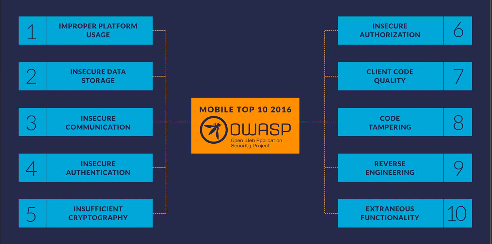

# Unidad 01 - Android Security Introduction

- Introduction to Androd SO

-- 


Añadiendo Contenido sobre ADB

ADB es una herramienta indispensable para los desarrolladores de aplicaciones Android y para aquellos que realizan tareas de mantenimiento o diagnóstico en estos dispositivos. A continuación, se detallan algunos aspectos y funcionalidades clave que hacen de ADB una herramienta poderosa:

Instalación y Gestión de Aplicaciones: ADB permite la instalación de aplicaciones directamente desde la línea de comandos, así como la desinstalación. Esto es especialmente útil para los desarrolladores que necesitan probar sus aplicaciones en diferentes dispositivos y configuraciones.

Depuración de Aplicaciones: Ofrece la capacidad de ejecutar una aplicación en un dispositivo o emulador y adjuntar un depurador para inspeccionar el comportamiento de la aplicación en tiempo real. Esto facilita la identificación y corrección de errores.

Acceso al Shell del Dispositivo: A través de ADB, los usuarios pueden acceder a la interfaz de comandos (shell) del dispositivo Android, lo que permite ejecutar comandos Unix/Linux directamente en el dispositivo. Esto es útil para explorar el sistema de archivos, modificar configuraciones del sistema o ejecutar scripts.

Transferencia de Archivos: ADB provee una manera sencilla de transferir archivos entre un dispositivo Android y una computadora. Esto es crucial para el desarrollo de aplicaciones, permitiendo a los desarrolladores copiar rápidamente nuevas versiones de aplicaciones al dispositivo o extraer logs y otros datos para análisis.

Automatización y Scripts: ADB puede ser usado en scripts para automatizar tareas repetitivas, como la ejecución de pruebas automatizadas, la recolección de logs, o la configuración de dispositivos en masa.

Acceso a Funciones Específicas del Dispositivo: Permite a los desarrolladores acceder y modificar configuraciones del dispositivo que no están disponibles a través de la interfaz gráfica de usuario. Esto incluye ajustes de red, configuraciones del sistema operativo y más.

Solución de Problemas y Recuperación: ADB es una herramienta valiosa para diagnosticar problemas con dispositivos Android. Puede ser utilizado para obtener logs del sistema, forzar la detención de aplicaciones problemáticas o incluso en procesos de recuperación de dispositivos que no arrancan correctamente.


```bash
adb shell

adb install application.apk

adb devices -l

adb connect ip:port

adb forward tcp:31415 tcp:31415

adb pull /data/data/app /destino/ordenador

adb push /destino/ordenador /data/data/app

adb shell logcat | grep NombreApp

adb root

adb mount

adb kill-server

adb shell ls

adb shell pwd

adb shell screencap /mnt/sdcard/Download/test.png

adb shell getprop
```


